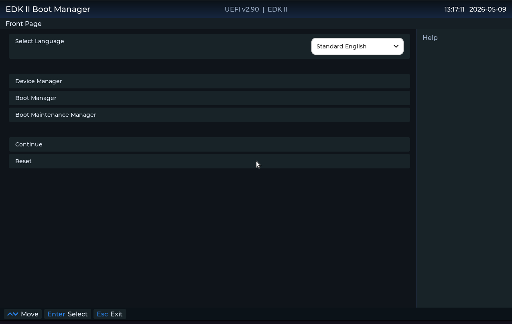
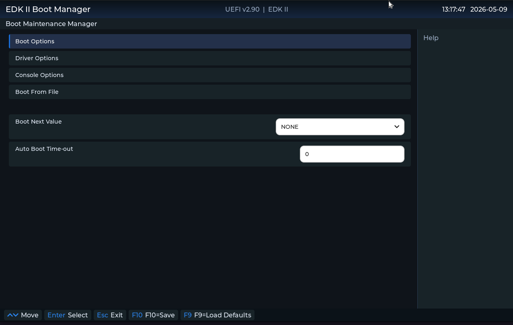
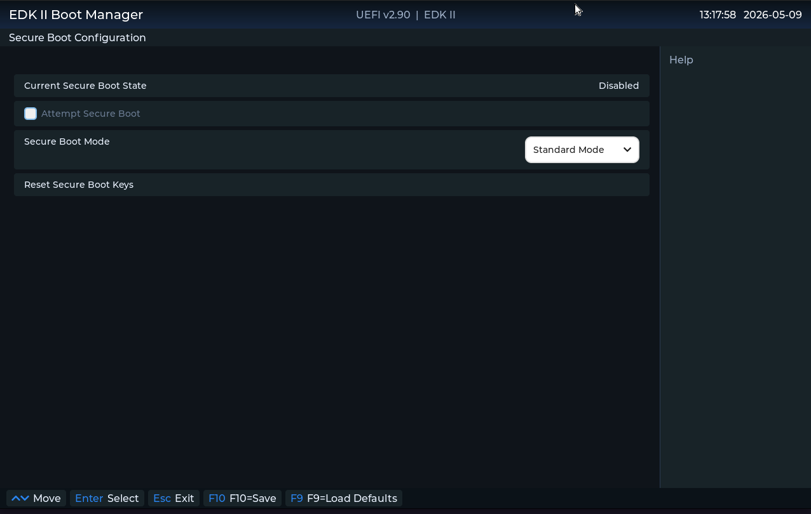

# LvglPkg -- LVGL-based UEFI HII Form Renderer

An EDK2 package that replaces the native text-based HII Form Browser UI with an
[LVGL](https://github.com/lvgl/lvgl)-based graphical renderer.



## Project Goal

Replace EDK2's `DisplayEngineDxe` with `LvglDisplayEngineDxe`, which produces
`EFI_DISPLAY_ENGINE_PROTOCOL` and renders HII forms using LVGL widgets.
`SetupBrowserDxe` (the IFR parser, expression evaluator, and config router)
continues to operate unchanged -- only the rendering layer is replaced.

### Architecture

```
BDS (F2/DEL) -> EFI_FORM_BROWSER2_PROTOCOL (SetupBrowserDxe)
                    |
                    |  walks IFR, evaluates expressions, manages config
                    |
                    v
              EFI_DISPLAY_ENGINE_PROTOCOL <- REPLACED
              (LvglDisplayEngineDxe)
                    |
                    |  FORM_DISPLAY_ENGINE_FORM -> LVGL widgets
                    |
                    v
                  LVGL -> EFI_GRAPHICS_OUTPUT_PROTOCOL -> pixels on screen
```

IFR parsing is **not** reimplemented. `FormDisplay()` receives a clean linked
list of `FORM_DISPLAY_ENGINE_STATEMENT` structs -- one per visible question --
and maps each to an LVGL widget.

### IFR Opcode -> LVGL Widget Mapping

| IFR Opcode         | LVGL Widget          |
|--------------------|----------------------|
| SUBTITLE           | `lv_label` (styled)  |
| TEXT               | `lv_label`           |
| CHECKBOX           | `lv_checkbox`        |
| NUMERIC            | `lv_textarea` (digits only) |
| ONE_OF             | `lv_dropdown`        |
| STRING             | `lv_textarea`        |
| PASSWORD           | `lv_textarea` (password mode) |
| REF (goto)         | `lv_btn`             |
| ACTION             | `lv_btn`             |
| ORDERED_LIST       | vertical panel of rows with Up/Down buttons |

## Repository Structure

```
LvglPkg/
+--- Library/LvglLib/           LVGL UEFI port (display, mouse, keyboard)
|   +--- LvglLib.c              Init/deinit, tick, main loop
|   +--- LvglScaledDisplay.c    Logical-canvas upscaling for UI scale
|   +--- LvglUefiPort.c/.h      libc shim (malloc/string/etc.) for the LVGL build
|   +--- lv_port_indev.c        Mouse (AbsolutePointer) + keyboard input
|   +--- MouseCursorIcon.c      Mouse cursor bitmap used by lv_port_indev.c
|   +--- EscExitHandler.c       ESC-to-exit confirmation popup handling
|   `--- lvgl/                  Upstream LVGL source (submodule)
+--- Library/LvglUiConfigLib/   NVRAM/PCD UI configuration helpers
+--- LvglDisplayEngineDxe/      Display engine DXE driver (the main deliverable)
|   +--- LvglDisplayEngineDxe.c Protocol installation, entry/unload
|   +--- LvglFormRenderer.c     FormDisplay() -> LVGL widget builder + event loop
|   +--- LvglFormRenderer.h     Renderer types and API
|   +--- LvglAptioChrome.c/.h   Aptio-style chrome (header/footer/nav bar)
|   `--- AptioWallpaper.c       Background image data
+--- LvglSetupDxe/              Graphical UI Configuration setup form
+--- Include/                   Public headers (LvglLib.h, LvglTheme.h, ...)
+--- LvglPkg.dsc                Package build description
+--- LvglPkg.dec                Package declaration (PCDs)
`--- LICENSE                    MIT License
```

The GOP display flush and the AbsolutePointer/keyboard indev registration go through
LVGL's own built-in UEFI backend (`lvgl/src/drivers/uefi/`), enabled via
`LV_USE_UEFI 1` / `LV_USE_UEFI_INCLUDE "lv_uefi_edk2.h"` in `lv_conf.h`. `LvglLib.c`
and `lv_port_indev.c` wire it up and add the wheel-scroll and press/hold keyboard
handling the built-in drivers don't provide on their own.

## Prerequisites

- **Linux host** (tested on Ubuntu 24.04). Build instructions assume bash.
- **GCC** 13.x (a working `gcc`/`g++` toolchain). EDK2's `GCC5` tag was retired
  in late 2024; this package builds with toolchain tag `GCC`.
- **NASM** and **iASL** (`acpica-tools`) -- required by EDK2's `BaseTools`.
- **Python 3** -- used by the EDK2 build orchestrator.
- **QEMU** with `qemu-system-x86_64` for testing OVMF builds.
- An EDK2 checkout with submodules initialised:
  ```bash
  git clone --recursive https://github.com/tianocore/edk2.git
  cd edk2
  make -C BaseTools                    # build the EDK2 build tools
  ```
- LvglPkg checked out either as a sibling directory or as a submodule of the
  edk2 tree. The LVGL source is itself a submodule under `LvglPkg/Library/LvglLib/lvgl`,
  so `--recursive` (or a follow-up `git submodule update --init --recursive`)
  is required.

## Integration

Replacing the stock display engine in OVMF takes several coordinated edits.

### 1. DSC -- replace the display engine module

In `OvmfPkg/OvmfPkgX64.dsc`, find and remove:
```
MdeModulePkg/Universal/DisplayEngineDxe/DisplayEngineDxe.inf
```
and replace it with:
```
LvglPkg/LvglDisplayEngineDxe/LvglDisplayEngineDxe.inf
```

### 2. FDF -- replace the display engine in the firmware image

In `OvmfPkg/OvmfPkgX64.fdf`, do the same swap:
```
# remove
INF  MdeModulePkg/Universal/DisplayEngineDxe/DisplayEngineDxe.inf
# add
INF  LvglPkg/LvglDisplayEngineDxe/LvglDisplayEngineDxe.inf
```

### 3. Setup DXE + config library -- Graphical UI Configuration form

`LvglSetupDxe` publishes the **Graphical UI Configuration** form (UI scale,
centered aspect-ratio frame -- see [Configuration](#configuration) below) and
is part of the standard integration alongside the display engine.

In `OvmfPkg/OvmfPkgX64.dsc`, add the driver to `[Components]` next to
`LvglDisplayEngineDxe.inf`:
```
LvglPkg/LvglSetupDxe/LvglSetupDxe.inf
```
and map its config library in `[LibraryClasses]`:
```
LvglUiConfigLib|LvglPkg/Library/LvglUiConfigLib/LvglUiConfigLib.inf
```

In `OvmfPkg/OvmfPkgX64.fdf`, add the driver to the DXE FV section next to
`LvglDisplayEngineDxe.inf`:
```
INF  LvglPkg/LvglSetupDxe/LvglSetupDxe.inf
```

### 4. USB mouse -- switch to the AbsolutePointer driver

LVGL needs `EFI_ABSOLUTE_POINTER_PROTOCOL`. EDK2 ships two USB mouse drivers,
and they cannot coexist -- `UsbMouseDxe` advertises a higher driver-binding
`Version` than `UsbMouseAbsolutePointerDxe`, so the core picks it first and
locks `UsbIo` `BY_DRIVER`, blocking the AbsolutePointer driver. Remove the
former, add the latter.

In `OvmfPkg/Include/Dsc/UsbComponents.dsc.inc` and
`OvmfPkg/OvmfPkgX64.fdf` (under the DXE FV section):
```
# remove
MdeModulePkg/Bus/Usb/UsbMouseDxe/UsbMouseDxe.inf
# add
MdeModulePkg/Bus/Usb/UsbMouseAbsolutePointerDxe/UsbMouseAbsolutePointerDxe.inf
```

QEMU must use `-device usb-mouse` (Boot/Mouse class), **not** `-device usb-tablet`
-- neither EDK2 mouse driver binds to tablet's HID report descriptor.

> **Shortcut -- add-only integration**
>
> If you'd rather not edit the stock OVMF lines, you can simply **add**
> `LvglPkg/LvglDisplayEngineDxe/LvglDisplayEngineDxe.inf` to the DSC
> `[Components]` section and the FDF DXE FV section without removing
> `MdeModulePkg/Universal/DisplayEngineDxe/DisplayEngineDxe.inf`. Both
> drivers will be built and dispatched, but only one `EFI_DISPLAY_ENGINE_PROTOCOL`
> producer wins -- whichever is installed last. In practice
> `LvglDisplayEngineDxe` reliably takes over because it dispatches after the
> stock module. The same shortcut applies to the mouse driver: leaving
> `UsbMouseDxe` in place will block AbsolutePointer (driver-binding `Version`
> sort), so for mouse input the swap in step 4 is **not** optional.

### 5. PACKAGES_PATH

Tell the EDK2 build where LvglPkg lives:
```bash
export PACKAGES_PATH=$HOME/workspace/edk2:$HOME/workspace/edk2/LvglPkg
```
(adjust paths if your checkout is elsewhere).

## Configuration

LvglPkg separates **theme** values (rebuild to change) from **platform defaults**
(DSC PCDs) and **user settings** (setup form, stored in NVRAM).

### Graphical UI Configuration

`LvglSetupDxe` publishes a **Graphical UI Configuration** form for:

- **UI scale** -- 1x / 1.5x / 2x logical-canvas upscaling (useful on HiDPI panels)
- **Centered aspect-ratio frame** -- optional letterboxed window instead of
  edge-to-edge chrome (useful on ultrawide displays)

Settings are stored in the non-volatile `LvglUiScale` variable. A **reboot is
required** for changes to take effect.

Wiring `LvglSetupDxe` and `LvglUiConfigLib` into a platform DSC/FDF is part of
the standard integration -- see [step 3](#3-setup-dxe--config-library----graphical-ui-configuration-form)
above.

### Platform PCDs

Override package defaults in the platform DSC `[PcdsFixedAtBuild]` section.
Declared in `LvglPkg.dec`:

| PCD | Purpose |
|-----|---------|
| `PcdLvglHelpPaneWidthPct` | Help pane width (% of content row) |
| `PcdLvglAptioHeaderTitle` | Header bar title (left) |
| `PcdLvglAptioHeaderVendor` | Header bar vendor string (center) |
| `PcdLvglCenteredFrameEnabled` | Enable centered frame by default |
| `PcdLvglCenteredFrameHeightPct` | Frame height (% of display height) |
| `PcdLvglCenteredFrameAspectNum` / `Den` | Frame aspect ratio (e.g. 16:9) |

Example:

```ini
[PcdsFixedAtBuild]
  gLvglPkgTokenSpaceGuid.PcdLvglAptioHeaderTitle|"My Firmware Setup"
  gLvglPkgTokenSpaceGuid.PcdLvglCenteredFrameEnabled|TRUE
```

### Theme (`Include/LvglTheme.h`)

Colors, fonts, padding, and widget styling used by the renderer. Edit and
rebuild to restyle the UI. Chrome **strings**, help-pane **width**, and
centered-frame **defaults** are controlled by PCDs and/or the setup form
instead.

## Build

### Standalone -- verify the package compiles
```bash
. edksetup.sh
build -p LvglPkg/LvglPkg.dsc -a X64 -t GCC -b RELEASE
```

### Integrated into OVMF -- produces a bootable firmware image
```bash
cd ~/workspace/edk2
. edksetup.sh
export PACKAGES_PATH=$HOME/workspace/edk2:$HOME/workspace/edk2/LvglPkg
build -a X64 -t GCC -b DEBUG -p OvmfPkg/OvmfPkgX64.dsc
```

Outputs:
- `Build/OvmfX64/DEBUG_GCC/FV/OVMF_CODE.fd` -- read-only firmware (code)
- `Build/OvmfX64/DEBUG_GCC/FV/OVMF_VARS.fd` -- variable store (writable)

## Run in QEMU

Stage the variable store and any user `.efi` files, then launch:

```bash
mkdir -p /tmp/efi_files
cp Build/OvmfX64/DEBUG_GCC/FV/OVMF_VARS.fd /tmp/OVMF_VARS.fd

qemu-system-x86_64 \
  -machine q35 \
  -m 512M \
  -smp 2 \
  -drive if=pflash,format=raw,unit=0,readonly=on,file=Build/OvmfX64/DEBUG_GCC/FV/OVMF_CODE.fd \
  -drive if=pflash,format=raw,unit=1,file=/tmp/OVMF_VARS.fd \
  -drive format=raw,file=fat:rw:/tmp/efi_files \
  -device qemu-xhci,id=xhci \
  -device usb-kbd,bus=xhci.0 \
  -device usb-mouse,bus=xhci.0 \
  -display gtk \
  -serial stdio
```

Press **F2** or **DEL** at the OVMF splash to enter Setup -- HII forms render
through LVGL. Exit QEMU with `Ctrl+A` then `X` (when `-serial stdio` is used).

## Troubleshooting

- **Mouse cursor doesn't move / no response** -- `UsbMouseDxe` is still in the
  firmware. Check `OvmfPkg/Include/Dsc/UsbComponents.dsc.inc` and the FDF;
  both `UsbMouseDxe` references must be replaced with `UsbMouseAbsolutePointerDxe`.
  Also verify QEMU launches with `-device usb-mouse`, not `usb-tablet`.
- **Black screen on entering Setup** -- the stock `DisplayEngineDxe` was not
  removed and is winning protocol-installation order, or LvglDisplayEngineDxe
  failed to load. Re-check both DSC and FDF -- the swap must happen in both
  files.
- **`build` fails with "package not found"** -- `PACKAGES_PATH` is not set, or
  doesn't contain the directory holding `LvglPkg/`. Echo it and verify.
- **`fatal error: lvgl/lvgl.h: No such file or directory`** -- the LVGL
  submodule wasn't initialised. Run `git submodule update --init --recursive`
  inside `LvglPkg`.
- **Stale build artefacts** -- when toggling between DSC variants, wipe the
  output directory: `rm -rf Build/OvmfX64`.

## Screenshots

**Boot Maintenance Manager** -- mixed widgets (list, dropdown, numeric field)
with F9/F10 hotkeys in the footer:



**Secure Boot Configuration** -- checkbox + dropdown + grayed-out read-only row:



## Status

`FormDisplay()` works end-to-end. All major IFR opcodes map to LVGL widgets.
Keyboard navigation (UP/DOWN focus, ENTER to edit, ESC to exit), mouse input,
and string field commits are functional.

### Done
- [x] LvglDisplayEngineDxe -- `EFI_DISPLAY_ENGINE_PROTOCOL` producer
- [x] `FormDisplay()` IFR -> LVGL widget builder
- [x] AbsolutePointer mouse input
- [x] Mouse wheel
- [x] Keyboard navigation (UP/DOWN focus, ESC exits, ENTER toggles editing)
- [x] `EFI_IFR_ORDERED_LIST_OP` renderer with reorder commit
- [x] String field value commit (`HiiSetString` + pool buffer)
- [x] Aptio-style chrome (header/footer/nav/help pane)
- [x] Function-key hotkeys (F9 Load Defaults, F10 Save, driver-registered hotkeys)
- [x] Theme/styling pass (fonts, colors, readability)
- [x] Software UI scaling (1x / 1.5x / 2x) via logical-canvas upscaling
- [x] Graphical UI Configuration setup form (`LvglSetupDxe`)
- [x] Opt-in centered aspect-ratio frame with letterbox backdrop
- [x] Platform PCDs for chrome strings and layout defaults
- [x] Front-page banner label refresh from HII
- [x] Device model shown in the subtitle bar
- [x] HII confirm/popup dialogs (`EFI_HII_POPUP_PROTOCOL`)
- [x] On-screen keyboard (shown for text entry when a pointer is present)
- [x] `grayoutif` / disabled control rendering

### TODO
- [ ] VS2022 / AARCH64-GCC / Clang toolchain support
- [ ] Source cleanup (remove unused entries from `.inf`)

## Origin

Originally forked from [YangGangUEFI/LvglPkg](https://github.com/YangGangUEFI/LvglPkg),
which provides the LVGL-to-UEFI port (GOP display driver, input handling).
This repository is now maintained independently. The display engine
replacement and HII integration is original work by the current maintainer.

The original LVGL UEFI port code remains under its original copyright; see
[LICENSE](./LICENSE).

## Star History

<a href="https://www.star-history.com/?repos=hamitcan99%2FLvglPkg&type=date&legend=top-left">
 <picture>
   <source media="(prefers-color-scheme: dark)" srcset="https://api.star-history.com/chart?repos=hamitcan99/LvglPkg&type=date&theme=dark&legend=top-left" />
   <source media="(prefers-color-scheme: light)" srcset="https://api.star-history.com/chart?repos=hamitcan99/LvglPkg&type=date&legend=top-left" />
   
 </picture>
</a>

## License

MIT License. See [LICENSE](./LICENSE).
